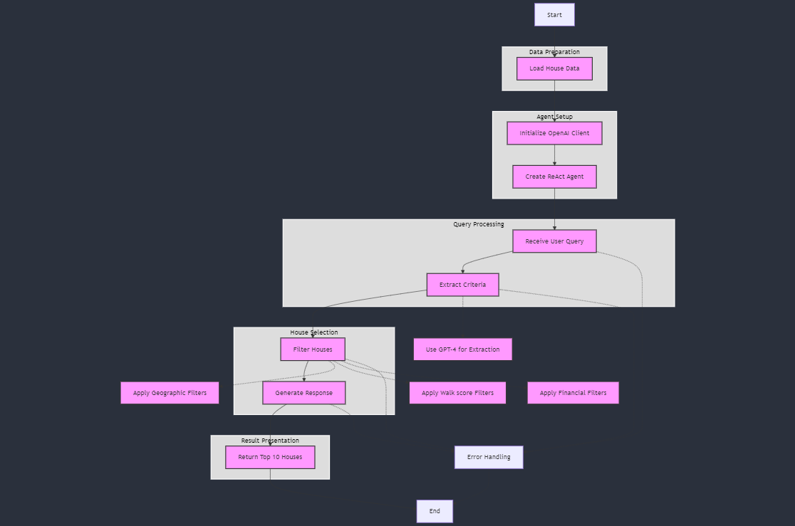

# Lets_Build_Real_Estate_Advisor_Company_Using_AI_Agents
Let's Build Real Estate Advisor Company Using AI Agents

## Introduction

Full Article : [https://medium.com/@learn-simplified/lets-build-a-real-estate-advisory-company-using-ai-agents-59d6e2bac78a

Picture this: You're in the market for a new home, overwhelmed by endless listings and conflicting advice. What if there was a smart, tireless assistant who could sift through all that data and find your perfect match? That's exactly what I set out to create. In this article, I'll walk you through how I built an AI-powered real estate advisory system from the ground up. It's a journey that combines cutting-edge technology with the age-old dream of finding the ideal place to call home.


## What's This Project About

This article is a deep dive into creating an AI-powered real estate advisory system. I'll take you through the process of developing an intelligent agent that can understand complex property queries, extract key criteria, and provide tailored recommendations. We'll explore how to use language models to interpret natural language inputs, implement custom tools for filtering properties, and design a system that can handle the nuances of real estate searches. You'll see how we can combine various AI technologies to create a more interactive and personalized property search experience. Whether you're a tech enthusiast, a real estate professional, or just curious about the future of home buying, this article will give you insights into how AI is transforming the industry.

## Why Work on It?

AI is rapidly changing the business landscape, and real estate is no exception. This article offers a practical example of how AI can be implemented in a traditional industry to create new value. By following along, you'll gain insights into:
 - How AI can process complex, natural language queries and turn them into actionable data
 - The process of building a custom AI agent tailored to a specific business need
 - Techniques for making AI systems more robust and error-resistant
 - The potential for AI to personalize and streamline customer experiences

While our company is fictional, the techniques and technologies discussed are very real and applicable across many industries. This article will give you a concrete understanding of how AI can be leveraged to create smarter, more efficient business processes.

## Architecture



# Tutorial: How I Built Supply Chain Optimization Using AI Agents

## Prerequisites
- Python installed on your system.
- A basic understanding of virtual environments and command-line tools.

## Steps

1. **Virtual Environment Setup:**
   - Create a dedicated virtual environment for our project:
   
     ```bash
     python -m venv Lets_Build_Real_Estate_Advisor_Company_Using_AI_Agents
     ```
   - Activate the environment:
   
     - Windows:
       ```bash
       Lets_Build_Real_Estate_Advisor_Company_Using_AI_Agents\Scripts\activate
       ```
     - Unix/macOS:
       ```bash
       source Lets_Build_Real_Estate_Advisor_Company_Using_AI_Agents/bin/activate
       ```
   
# Installation and Setup Guide

**Install Project Dependencies:**

Follow these steps to set up and run the 'Real Estate Advisory Company Using AI Agents' project:

1. Navigate to your project directory:
   ```
   cd path/to/your/project
   ```
   This ensures you're in the correct location for the subsequent steps.

2. Install the required dependencies:
   ```
   pip install -r requirements.txt
   ```
   This command installs all the necessary Python packages listed in the requirements.txt file.


## Run - Real Estate Advisory Company Using AI Agents

   ```bash 
      # Run Real Estate Advisory Company Using AI Agents
      python app.py
      
   ```


